<a id="readme-top"></a>
[![Contributors][contributors-shield]][contributors-url]
[![Forks][forks-shield]][forks-url]
[![Stargazers][stars-shield]][stars-url]
[![Issues][issues-shield]][issues-url]


<!-- PROJECT LOGO -->
<br />
<div align="center">
  <a href="https://github.com/trawngson/aware">
    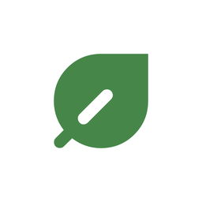
  </a>

<h3 align="center">AWARE (AI Waste-sorting and Recycling Enhancement)</h3>

  <p align="center">
    Recycling made simple. Leverage your recycling game with our points system and ideas gallery.
    <br />
    <br />
    <a href="#a-quick-tour">Take the tour</a>
    ·
    <a href="https://github.com/trawngson/aware/issues/new?labels=bug&template=bug-report---.md">Report Bug</a>
    ·
    <a href="https://github.com/trawngson/aware/issues/new?labels=enhancement&template=feature-request---.md">Request Feature</a>
  </p>
</div>


<p align="center">
  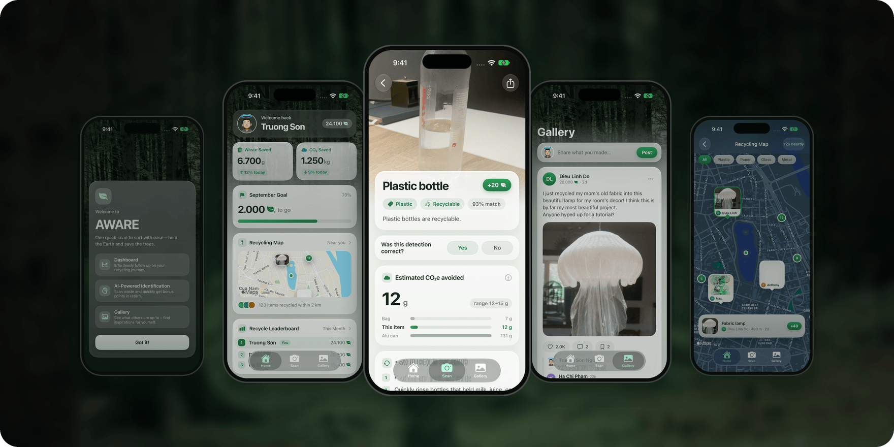
</p>


<!-- ABOUT THE PROJECT -->
## About The Project

<p>AWARE (AI Waste-sorting and Recycling Enhancement) is a SwiftUI iOS application that uses an on-device Ultralytics YOLO/Core ML detector to identify common household waste and provide recycling guidance. The app includes Home, Scan, and Gallery experiences with sample gamification and community content. The reproducible v1 research pipeline uses a seven-class ontology and approved training data from TACO v1.0 plus a reviewed Open Images V7 subset; COCO is used only through pretrained model weights.</p>

### A quick tour

<table>
  <tr>
    <td width="40%" align="center">
      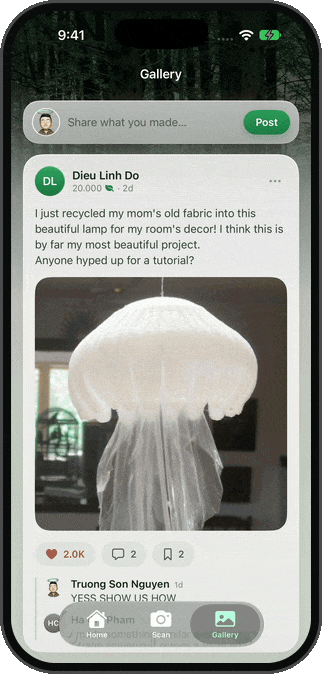
    </td>
    <td width="60%">
      <h3>Scan it, sort it</h3>
      <p>Point the camera at an item. The YOLO model runs on the phone and outlines what it sees as you move. When it's sure and the item holds still for a second, AWARE opens the guidance:</p>
      <ul>
        <li><b>What it is</b>: plastic bottle, glass bottle or jar, metal can, cardboard, plastic bag, disposable cup or styrofoam</li>
        <li><b>Where it goes</b>, following Hanoi's household waste sorting rules, with the steps to get it ready</li>
        <li><b>What it saves</b>: an estimate of the CO₂e avoided, based on the EPA's Waste Reduction Model</li>
        <li><b>Leaves</b> for recycling it, and a quick fix when the model gets it wrong</li>
      </ul>
      <p>Add it to the Gallery to show everyone what you sorted.</p>
    </td>
  </tr>
</table>

<table>
  <tr>
    <td width="33%" align="center">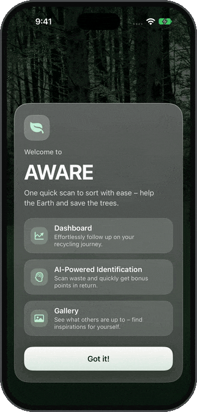</td>
    <td width="33%" align="center">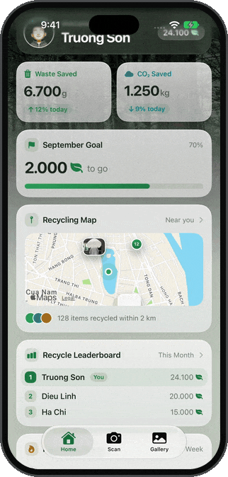</td>
    <td width="33%" align="center">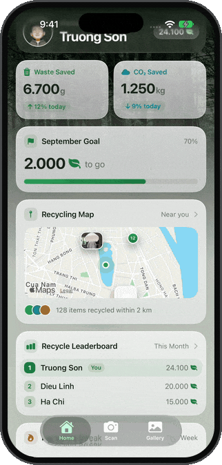</td>
  </tr>
  <tr>
    <td valign="top"><b>Home</b><br>Your leaves, the waste and CO₂ you've saved, the month's goal, your streak and recent scans, and how the whole community is doing.</td>
    <td valign="top"><b>Recycling map</b><br>What people have recycled and made around you. Filter by material and open a project from its card.</td>
    <td valign="top"><b>Gallery</b><br>Upcycling ideas from the community: like, save, read the replies, and get inspired for your own.</td>
  </tr>
  <tr>
    <td width="33%" align="center">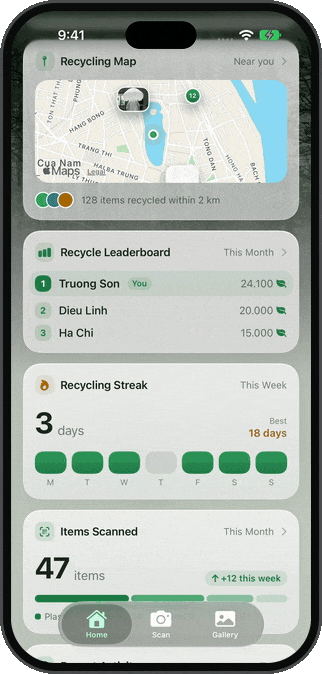</td>
    <td width="33%" align="center">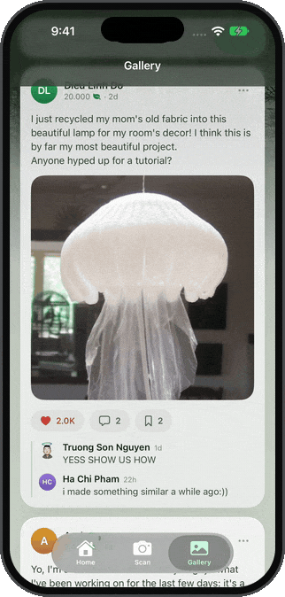</td>
  </tr>
  <tr>
    <td valign="top"><b>Insights</b><br>Tap Waste Saved or CO₂ Saved for the trend, a breakdown by material, and what it all adds up to in trees and water.</td>
    <td valign="top"><b>Share what you made</b><br>Post a photo of your project with tags and steps so others can make it too.</td>
  </tr>
</table>

### Screenshots

<p align="center">
  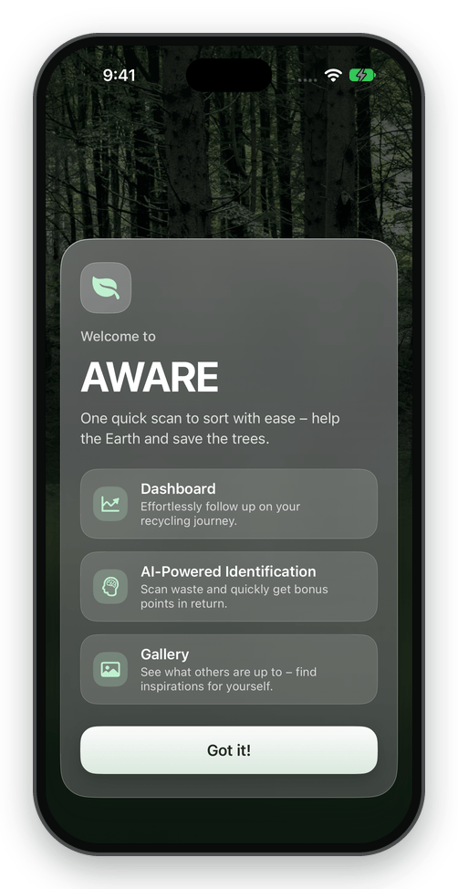
  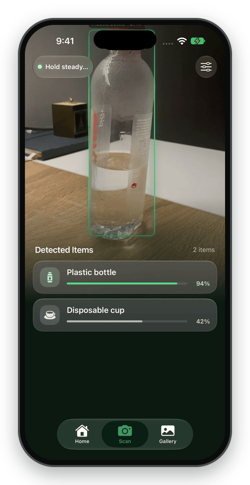
  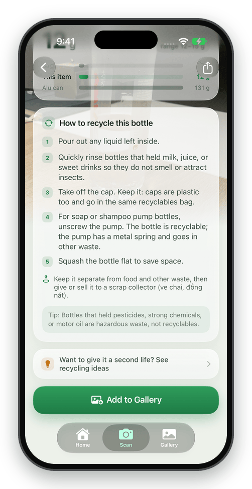
  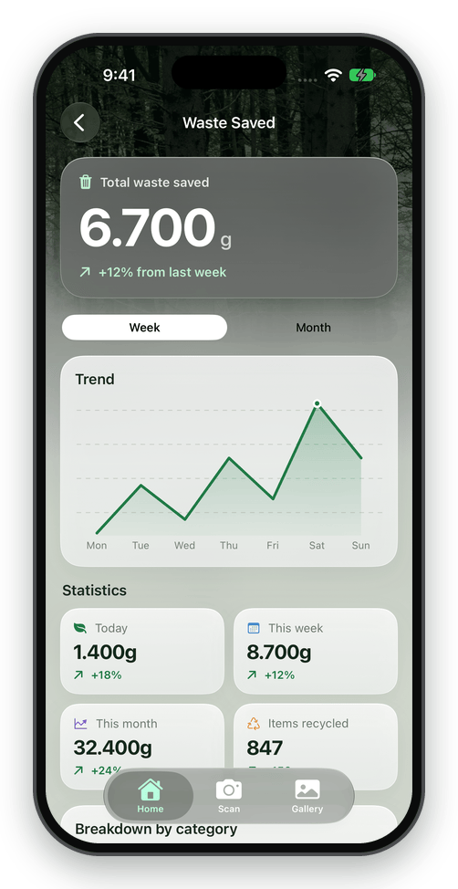
  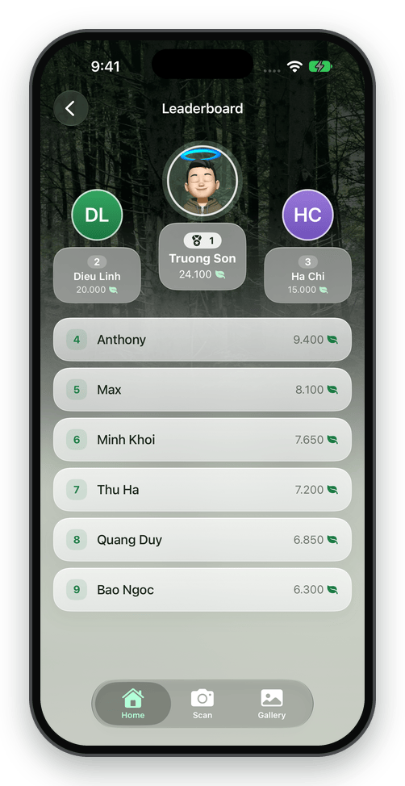
  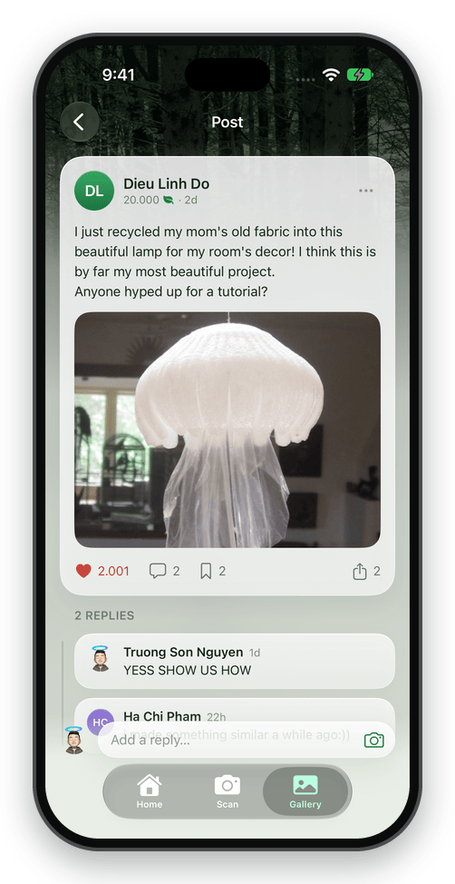
  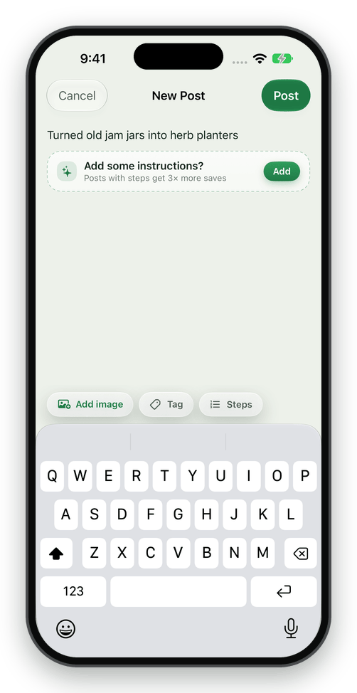
  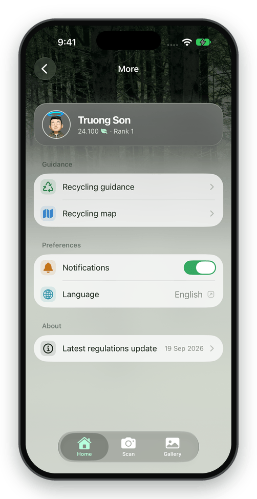
</p>

<p align="center"><sub>Captured on the iOS simulator by the <a href=".github/workflows/ios-render-check.yml">iOS render check</a>; <a href=".github/scripts/readme-media.py"><code>readme-media.py</code></a> turns a run into these images.</sub></p>

<p align="right">(<a href="#readme-top">back to top</a>)</p>


### Built With

* SwiftUI
* Core ML
* Ultralytics YOLO

<p align="right">(<a href="#readme-top">back to top</a>)</p>


<!-- GETTING STARTED -->
## Getting Started

### Supported Devices
AWARE currently supports:
- iOS 18.0+
- iPadOS 18.0+

### Run from Source

Follow these steps to clone, configure, and run the **AWARE** application locally on your machine using Xcode.

#### Prerequisites

Before getting started, ensure you have the following installed on your Mac:
* **macOS**: Version 14.0 (Sonoma) or later
* **Xcode**: Version 15.0 or later
* **Swift**: Version 5.9 or later

#### Installation & Setup

**1. Clone the Repository:**
Open your terminal and clone the repository to your local machine:
```bash
git clone https://github.com/trawngson/aware.git
cd aware
```

**2. Open the Project in Xcode:**
Open the `.xcodeproj` file directly from your terminal:
```bash
open awareapp.xcodeproj
```

**3. Configure Dependencies:**
Once Xcode opens, it will automatically begin resolving packages via Swift Package Manager (SPM). Wait for the background resolution process to complete before building.

#### Running the Application
1. Select your target device from the Xcode scheme dropdown menu at the top (e.g., an iOS Simulator or your connected physical iOS device).
2. Press ⌘ + R (Command + R) or click the Play button in the top-left corner to build and run the application.
3. To view real-time log outputs or system print statements, press ⌘ + ⇧ + C to open the Xcode debug console.

<p align="right">(<a href="#readme-top">back to top</a>)</p>


<!-- CONTRIBUTING -->
## Contributing

Contributions are what make the open source community such an amazing place to learn, inspire, and create. Any contributions you make are **greatly appreciated**.

If you have a suggestion that would make this better, please fork the repo and create a pull request. You can also simply open an issue with the tag "enhancement".
Don't forget to give the project a star! Thanks again!

1. Fork the Project
2. Create your Feature Branch (`git checkout -b feature/AmazingFeature`)
3. Commit your Changes (`git commit -m 'Add some AmazingFeature'`)
4. Push to the Branch (`git push origin feature/AmazingFeature`)
5. Open a Pull Request

<p align="right">(<a href="#readme-top">back to top</a>)</p>

### Top contributors:

<a href="https://github.com/trawngson/aware/graphs/contributors">
  
</a>


<!-- LICENSE -->
## License

Distributed under the MIT License. See `LICENSE.txt` for more information.
<p align="right">(<a href="#readme-top">back to top</a>)</p>

<!-- CONTACT -->
## Contact

Truong Son - contact@truongson.me

Project Link: [https://github.com/trawngson/aware](https://github.com/trawngson/aware)

<p align="right">(<a href="#readme-top">back to top</a>)</p>


<!-- MARKDOWN LINKS & IMAGES -->
<!-- https://www.markdownguide.org/basic-syntax/#reference-style-links -->
[contributors-shield]: https://img.shields.io/github/contributors/trawngson/aware.svg?style=for-the-badge
[contributors-url]: https://github.com/trawngson/aware/graphs/contributors
[forks-shield]: https://img.shields.io/github/forks/trawngson/aware.svg?style=for-the-badge
[forks-url]: https://github.com/trawngson/aware/network/members
[stars-shield]: https://img.shields.io/github/stars/trawngson/aware.svg?style=for-the-badge
[stars-url]: https://github.com/trawngson/aware/stargazers
[issues-shield]: https://img.shields.io/github/issues/trawngson/aware.svg?style=for-the-badge
[issues-url]: https://github.com/trawngson/aware/issues
[license-shield]: https://img.shields.io/github/license/trawngson/aware.svg?style=for-the-badge
[license-url]: https://github.com/trawngson/aware/blob/master/LICENSE.txt
[linkedin-shield]: https://img.shields.io/badge/-LinkedIn-black.svg?style=for-the-badge&logo=linkedin&colorB=555
[linkedin-url]: https://linkedin.com/in/linkedin_username
[product-screenshot1]: https://github.com/user-attachments/assets/d55624e4-ac76-4e46-bf16-9188aa0d63dc
[product-screenshot2]: https://github.com/user-attachments/assets/99f667ad-ef31-4a47-8293-d5c3f2783ca8
[product-screenshot3]: https://github.com/user-attachments/assets/7300d1ed-f8cd-45de-8f1e-39321b302b39
[product-screenshot4]: https://github.com/user-attachments/assets/66fa5447-4890-4fc9-9b63-425538df6468
[Flutter]: https://img.shields.io/badge/Swift-F05138?logo=swift&logoColor=white
[Flutter-url]: https://developer.apple.com/swift/
[Firebase]: https://img.shields.io/badge/-YOLO-FFCC00?style=flat&logo=python&logoColor=white&size=40x40
[Firebase-url]: https://docs.ultralytics.com/vi
[Vue.js]: https://img.shields.io/badge/Vue.js-35495E?style=for-the-badge&logo=vuedotjs&logoColor=4FC08D
[Vue-url]: https://vuejs.org/
[Angular.io]: https://img.shields.io/badge/Angular-DD0031?style=for-the-badge&logo=angular&logoColor=white
[Angular-url]: https://angular.io/
[Svelte.dev]: https://img.shields.io/badge/Svelte-4A4A55?style=for-the-badge&logo=svelte&logoColor=FF3E00
[Svelte-url]: https://svelte.dev/
[Laravel.com]: https://img.shields.io/badge/Laravel-FF2D20?style=for-the-badge&logo=laravel&logoColor=white
[Laravel-url]: https://laravel.com
[Bootstrap.com]: https://img.shields.io/badge/Bootstrap-563D7C?style=for-the-badge&logo=bootstrap&logoColor=white
[Bootstrap-url]: https://getbootstrap.com
[JQuery.com]: https://img.shields.io/badge/jQuery-0769AD?style=for-the-badge&logo=jquery&logoColor=white
[JQuery-url]: https://jquery.com 
