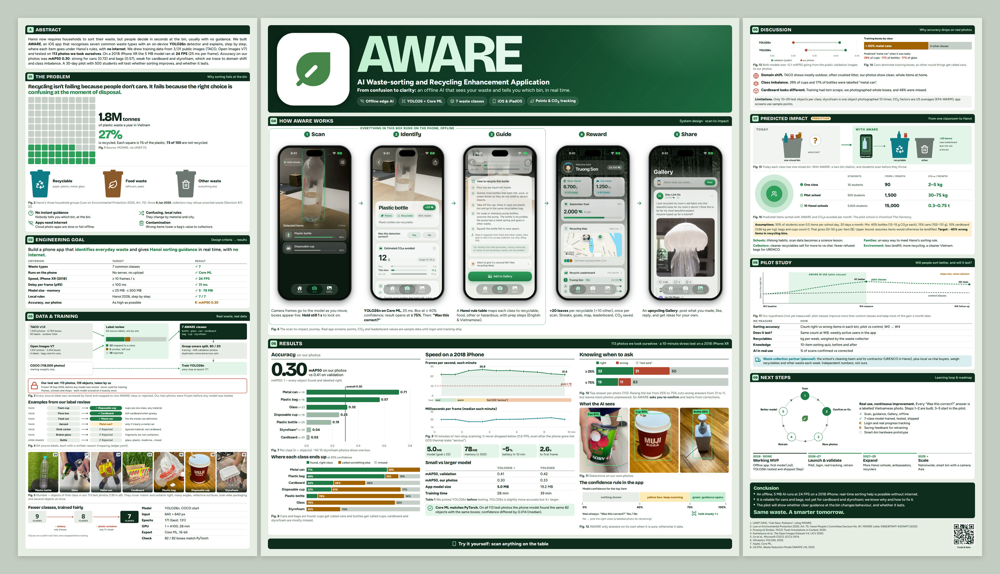

# AWARE science fair board

A tri-fold board for AWARE, designed at real size and printed on A3 sheets.



## Size

| Panel | Width × height | A3 sheets |
|---|---|---|
| Left wing | 40 × 90 cm | 4, landscape (1 column × 4 rows) |
| Centre | 80 × 90 cm | 9, portrait (3 columns × 3 rows) |
| Right wing | 40 × 90 cm | 4, landscape (1 column × 4 rows) |

Laid flat the board is 160 × 90 cm. With the wings folded forward about 60°,
it is about 120 cm wide and fits on the 1.2 m table.

```
 seen from above, standing on the table
        /______________________\
       /         80 cm          \
  40 cm                          40 cm
 +--------------------------------------+
 |               table, 1.2 m           |
 +--------------------------------------+
```

## Files

- `out/AWARE-board-A3-sheets.pdf`: the 17 sheets to print, in board order.
- `out/panel-*.pdf`: each panel as one full-size page, for a print shop.
- `out/preview.png`: the whole board, for checking.

## Printing

1. Print `AWARE-board-A3-sheets.pdf` on A3 in colour, best quality.
2. Set the scale to **100% / Actual size**. Turn off "Fit to page".
3. Measure the bar at the bottom right of a sheet. It must be exactly 50 mm.
   If it is not, the printer is scaling the pages and the sheets will not line up.

Each sheet is labelled in its bottom margin: `L2-1` means left wing, row 2,
column 1. The small grid next to the label shows where the sheet goes.

## Assembly

1. Cut foam board into 40 × 90, 80 × 90 and 40 × 90 cm panels.
2. On every sheet, cut off the white margin on the **top and left** exactly on the
   crop marks.
3. On the **right and bottom**, keep the printed 10 mm overlap strip (it has a
   dashed line on it) and cut off only the white margin beyond it. Sheets in a
   panel's last column or last row have no strip there: cut those edges on the
   crop marks.
4. Start at the top-left sheet of each panel. Lay the next sheet so its cut edge
   sits on the dashed line of the sheet before it, then glue it down (spray
   adhesive or a glue stick over the whole back).
5. Tape the panels together on the back with a 3 mm gap so the board can fold,
   then stand the wings at about 60°.

## Editing

`board.html` is the whole board, sized in millimetres. Open it in a browser to see
it. Every chart is drawn from the numbers in its script, which come from the
records in `backend/records/`:

| On the board | Record |
|---|---|
| Accuracy, per class and errors | `target-test-evaluations-v2.yaml` |
| iPhone XR speed, memory, battery, heat | `device-benchmark-results-v1.yaml` |
| YOLO26n vs YOLO26s | `model-selection-v1.yaml`, `coreml-parity-v1.yaml` |
| Label review | `backend/mapping_ledger.yaml` |
| Dataset sizes | `backend/source_manifest.yaml`, `open-images-train-selection-v1.json` |
| CO₂e per item | `impact-factors-v1.yaml` (EPA WARM v16) |
| Confidence rule, points, Hanoi rules | `app-model-release-v1.yaml`, `awareapp/Views/Scan/` |

Rebuild the print files after an edit:

```bash
node build.cjs
```

It needs Playwright with Chromium, ImageMagick (`convert`) and Python with `pypdf`.
The text on each panel is scaled automatically to fill it, so after an edit the
whole panel stays full without clipping.

Fonts: Bricolage Grotesque and Figtree (SIL Open Font License), saved in `fonts/`
so the print never depends on a network connection.
